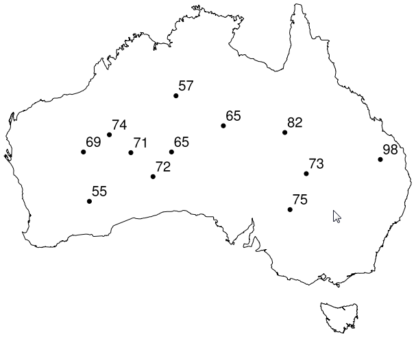
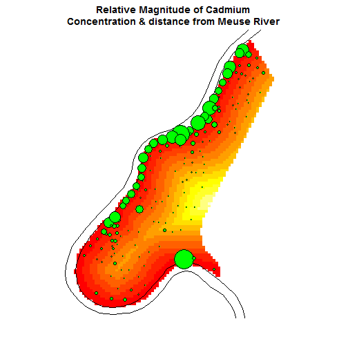
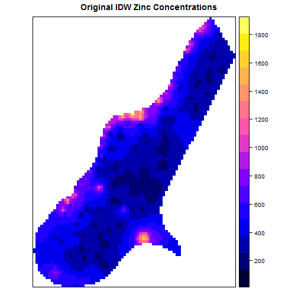
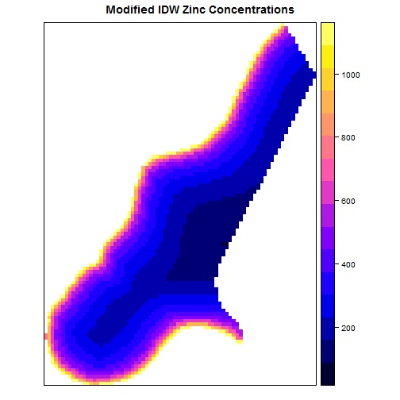
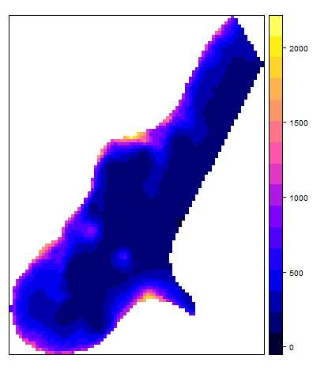
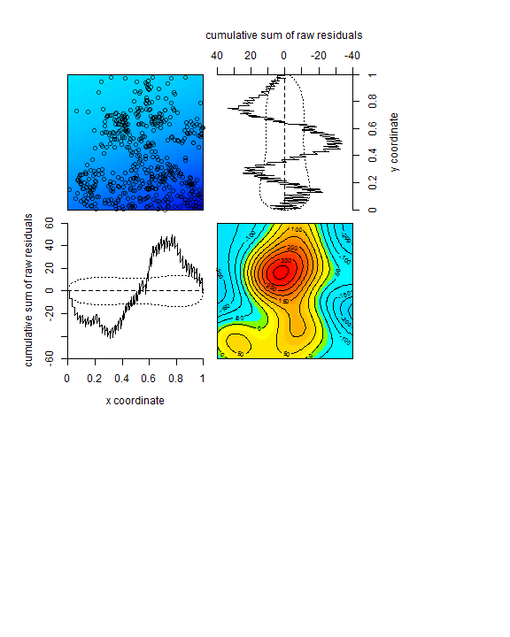

<!-- Limit image width and height -->
<style type='text/css'>
img {
    max-height: 800px;
    max-width: 1040px;
}

.title-slide {
  background-color: #FFFFFF;
  /* background-color: #CBE7A5; #EDE0CF; ; #CA9F9D*/
  /* background-image:url(http://goo.gl/EpXln); */
}

.title-slide hgroup > h1{
 font-family: 'Oswald', 'Helvetica', sanserif; 
}

.title-slide hgroup > h1, 
.title-slide hgroup > h2 {
  color: #731400 ;  /* ; #731400*/
}

slide:not(.segue) h2{
/*  color: #731400;*/
/*  color: #731400;*/
  color: #731400;
}

.segue hgroup > h1{
 font-family: 'Oswald', 'Helvetica', sanserif; 
 font-size: 70px
}

.segue hgroup > h1, 
.segue hgroup > h2 {
  color: #731400 ;  /* ; #731400*/
}

.MathJax {
font-size: 2em;
}

</style>

<!-- Center image on slide -->
<script src="http://ajax.aspnetcdn.com/ajax/jQuery/jquery-1.7.min.js"></script>
<script type='text/javascript'>
$(function() {
    $("p:has(img)").addClass('centered');
});
</script>

<style>
strong {
  font-weight: bold;
}
</style>

## Welcome!

* You do not need to be an R/RStudio expert to start!
* I will give you the concepts and the basic code. 
* You as researchers can (should) study more if you want (have) to.
* Come back to these slides/concepts any time, see [References] ()
* End with a group exercise: tell me/show me how you will analyze this data
* Groups of 3-4, preferably 1 student with R/RStudio experience in each group

--- .segue

## Types of spatial data

---

## Geostatistical Data

* Surface has a value at every location, but we only take samples in certain locations. 
* Has underlying continuous surface


---

## Regional data

* Data measured/reported in fixed spatial extents.
* Example: census data aggregated by block group, census tract, county, etc.


---

## Point Patterns (no underlying surface)

* Location + other relevant metrics (Example: tree species locations + tree heights)



---

## Geostatistical vs. point pattern approaches

* Geostatistical methods
  * Spatial locations are treated as explanatory variables ((lat1, long1), (lat2, long2)...)
  * Values attached to locations are response variables (elev1, elev2...)
  * Example: Elevation at a point can be predicted by coordinates of a point 
  
  $elev_1 = \beta_1*(lat_1, long_1) + \beta_2*covariate1_\text{(lat1, long1)}$
  
* Point pattern methods
  * Treat spatial location AND values attached to locations as response variables 
  * Investigate covariate effects on point pattern intensity
  * Point is data-response is spatially explicit!
  * Example: Elevation at a point can be predicted by [x,y,z] variables
  
  $elev1_\text{(lat1, long1)}  = \beta_1*covariate1_\text{(lat1, long1)} + \beta_2*covariate2_\text{(lat1, long1)}$

---

## Geostatistical vs. point pattern methods

* Geostatistical methods
  * Response SURFACE can be characterized by response locations and other spatial covariates
  * Methods focus on characterizing SURFACE
  * Operations: interpolation, kriging, spatial regressions and lag models, variograms and correlograms
  
* Point pattern methods
  * Spatial location AND values can be explained by other spatial covariates
  * Methods focus on modeling the point pattern intensity in space
  * Operations: intensity and density maps, spatial covariate analysis, point pattern modeling, prediction & simulation 

---

## Quick Review: Spatial data structures

* Spatial data
  * Vectors: Points, lines, polygons (anything you can draw)
  * Rasters: numerical grids--each cell has a meaningful value (color, elevation, etc.)
      - Slightly more complicated methods- we won't cover this here

* Data frames are most common means of data storage in R
* Attach spatial information (lat/long, lines) to make data frames spatial
  + Points: SpatialPoints, SpatialPointsDataFrame
  + Lines: SpatialLines, SpatialLinesDataFrame
  + Polygons: SpatialPolygons, SpatialPolygonsDataFrame

--- .segue

## Geostatistical Methods
# What is the underlying value surface?
# How are features (points, lines, polygons) related to/affected by their neighbors?
# How can we accurately model spatially interdependent data?

---

## Meuse dataset

> Concentration of four heavy metals measured in the top soil in a flood plain along the river Meuse, with additional variables


```r
library(sp); 
data(meuse); summary(meuse); str(meuse);
```

```
##        x                y             cadmium           copper      
##  Min.   :178605   Min.   :329714   Min.   : 0.200   Min.   : 14.00  
##  1st Qu.:179371   1st Qu.:330762   1st Qu.: 0.800   1st Qu.: 23.00  
##  Median :179991   Median :331633   Median : 2.100   Median : 31.00  
##  Mean   :180005   Mean   :331635   Mean   : 3.246   Mean   : 40.32  
##  3rd Qu.:180630   3rd Qu.:332463   3rd Qu.: 3.850   3rd Qu.: 49.50  
##  Max.   :181390   Max.   :333611   Max.   :18.100   Max.   :128.00  
##                                                                     
##       lead            zinc             elev             dist        
##  Min.   : 37.0   Min.   : 113.0   Min.   : 5.180   Min.   :0.00000  
##  1st Qu.: 72.5   1st Qu.: 198.0   1st Qu.: 7.546   1st Qu.:0.07569  
##  Median :123.0   Median : 326.0   Median : 8.180   Median :0.21184  
##  Mean   :153.4   Mean   : 469.7   Mean   : 8.165   Mean   :0.24002  
##  3rd Qu.:207.0   3rd Qu.: 674.5   3rd Qu.: 8.955   3rd Qu.:0.36407  
##  Max.   :654.0   Max.   :1839.0   Max.   :10.520   Max.   :0.88039  
##                                                                     
##        om         ffreq  soil   lime       landuse       dist.m      
##  Min.   : 1.000   1:84   1:97   0:111   W      :50   Min.   :  10.0  
##  1st Qu.: 5.300   2:48   2:46   1: 44   Ah     :39   1st Qu.:  80.0  
##  Median : 6.900   3:23   3:12           Am     :22   Median : 270.0  
##  Mean   : 7.478                         Fw     :10   Mean   : 290.3  
##  3rd Qu.: 9.000                         Ab     : 8   3rd Qu.: 450.0  
##  Max.   :17.000                         (Other):25   Max.   :1000.0  
##  NA's   :2                              NA's   : 1
```

```
## 'data.frame':	155 obs. of  14 variables:
##  $ x      : num  181072 181025 181165 181298 181307 ...
##  $ y      : num  333611 333558 333537 333484 333330 ...
##  $ cadmium: num  11.7 8.6 6.5 2.6 2.8 3 3.2 2.8 2.4 1.6 ...
##  $ copper : num  85 81 68 81 48 61 31 29 37 24 ...
##  $ lead   : num  299 277 199 116 117 137 132 150 133 80 ...
##  $ zinc   : num  1022 1141 640 257 269 ...
##  $ elev   : num  7.91 6.98 7.8 7.66 7.48 ...
##  $ dist   : num  0.00136 0.01222 0.10303 0.19009 0.27709 ...
##  $ om     : num  13.6 14 13 8 8.7 7.8 9.2 9.5 10.6 6.3 ...
##  $ ffreq  : Factor w/ 3 levels "1","2","3": 1 1 1 1 1 1 1 1 1 1 ...
##  $ soil   : Factor w/ 3 levels "1","2","3": 1 1 1 2 2 2 2 1 1 2 ...
##  $ lime   : Factor w/ 2 levels "0","1": 2 2 2 1 1 1 1 1 1 1 ...
##  $ landuse: Factor w/ 15 levels "Aa","Ab","Ag",..: 4 4 4 11 4 11 4 2 2 15 ...
##  $ dist.m : num  50 30 150 270 380 470 240 120 240 420 ...
```

---&twocol w1:50% w2:50%

## Mapping meuse dataset

***=left


```r
coordinates(meuse)=~x+y;

data(meuse.riv); 
meuse.sr = SpatialPolygons(list(Polygons(
  list(Polygon(meuse.riv)),"meuse.riv")))
rv = list("sp.polygons", meuse.sr, 
          fill = "lightblue")

spplot(meuse["zinc"], do.log = TRUE,
	key.space = "bottom", 
	sp.layout = list(rv),
	main = "Zinc Concentration")
```

***=right


---&twocol w1:30% w2:50%

## Use spplot to overlay data 

***=left


```r
data(meuse.grid); 
coordinates(meuse.grid) = ~x+y; 
gridded(meuse.grid) = TRUE

meuse.sl = SpatialLines(list(Lines(list(
  Line(meuse.riv)), ID="1")))

par(mar=c(7,0,4,4)); 
image(meuse.grid["dist"], main = 
"Relative Magnitude of Cadmium 
Concentration & distance from Meuse River"); 
lines(meuse.sl); 

with(meuse, symbols(x=meuse@coords[,1], 
  y=meuse@coords[,2], circles=
    meuse@data$cadmium, inches=1/5, 
  col="black", bg="green", add=T))
```

***=right



---

## Interpolation

# Knowns: sample values in certain known points

# Goal: predict values at unknown points, create value surface over study area

# Assumption: things that are closer together are more alike than things that are farther apart

# Methods:

  * <strong>Trend</strong>: calculates best fit for entire surface area**

  * <strong>Inverse Distance Weighting (IDW)</strong>: closer samples are weighted heavily, predicted values are averages of sample data points around area of interest * individual weights

  * <strong>Kriging</strong>: similar to IDW, with finer controls on weights, directionality, and autocorrelation (statistical relationships between points). 
    * Uses semivariograms to define relationships between points, distances, and values.
    
  * <strong>Splines</strong>: regression line segments over entire study area--allows finer control over your fitted model
    * Minimizes overall surface curvature, good for gently varying surfaces 

---&twocol

## Inverse Distance-Weighted Interpolation of zinc concentrations

***=right


```r
library(gstat)
data(meuse); data(meuse.grid); 
coordinates(meuse.grid) = ~x+y; 
gridded(meuse.grid) = TRUE

zinc.idw = idw(zinc~1, meuse, 
               meuse.grid)

spplot(zinc.idw["var1.pred"], 
       main = "IDW Zinc 
       Concentrations")
```

***=left


```
## Error in plot.xy(xy.coords(x, y), type = type, ...): plot.new has not been called yet
```

---&twocol

## Investigate transformations using IDW results

***=left

```r
t1<-data.frame(zinc=meuse$zinc, 
    dist=meuse$dist)
p1<-ggplot(t1, aes(zinc, dist))+
  geom_point() + geom_smooth(method="lm")
p2<-ggplot(t1, aes(log(zinc), dist))+
  geom_point() + geom_smooth(method="lm")
p3<-ggplot(t1, aes(log(zinc), log(dist)))+
  geom_point() + geom_smooth(method="lm")
p4<-ggplot(t1, aes(log(zinc), sqrt(dist)))+
  geom_point() + geom_smooth(method="lm")

library(gridExtra)
grid.arrange(p1, p2, p3, p4, 
    nrow=2, ncol=2)
```

***=right


---&twocol

## Use transformation to get better IDW result

***=left

# Original IDW: zinc~1



***=right

#   Modified IDW: log(zinc)~sqrt(dist)



---&twocol

## Kriging

***=left
  
* Each point can be paired to every other point in your dataset. Each pair has a unique distance. 

* For each distance:

  $$ \text{SV(dist$_h$)} = 0.5*mean((v_2 - v_1)^2+(v_3 - v_1)^2...) $$

* Each distance has a semivariogram--which is too much to process. So we calculate AVERAGE semivariance for each distance.
* Plot semivariogram

***=right


---

## Kriging

* Fit a model to plotted semivariogram, model dependence structure
* Linear, Gaussian, Exponential, Circular, Spherical models


* Use this information to make predictions about your value surface!

---&twocol

## Fit Variogram to Meuse dataset

***=left


```r
lzn.vgm <- variogram(log(zinc)~1, meuse) 
lzn.fit <- fit.variogram(lzn.vgm, 
          model=vgm(, "Sph"))

# Here we only specify a spherical model.
# We can adjust sill, range, nugget, 
# kappa, etc. if we want

plot(lzn.vgm, lzn.fit)
```

***=right


---&twocol

## Use fitted model as basis for kriging

***=right

```r
lzn.kriged = krige(log(zinc)~1, 
      meuse, meuse.grid, model = lzn.fit)
lzn.kriged$transform<-
  exp(lzn.kriged$var1.pred)
spplot(lzn.kriged["transform"])
```

***=left


---&twocol

## Comparing IDW and Kriging results

***=left

# IDW:log(zinc)~sqrt(dist)


***=right

# Ordinary Kriging: log(zinc)~sqrt(dist)




---.segue

## Point Process methods
# Is the point process random?
# Does the process depend on spatial covariates? 
# How can the point process intensity be modelled?


--- &twocol

## Lansing Forest dataset

***=left

```r
library(spatstat); data(lansing); 
summary(lansing)
```

```
## Marked planar point pattern:  2251 points
## Average intensity 2251 points per square unit (one unit = 924 feet)
## 
## *Pattern contains duplicated points*
## 
## Coordinates are given to 3 decimal places
## i.e. rounded to the nearest multiple of 0.001 units (one unit = 924 feet)
## 
## Multitype:
##          frequency proportion intensity
## blackoak       135 0.05997335       135
## hickory        703 0.31230560       703
## maple          514 0.22834300       514
## misc           105 0.04664594       105
## redoak         346 0.15370950       346
## whiteoak       448 0.19902270       448
## 
## Window: rectangle = [0, 1] x [0, 1] units
## Window area = 1 square unit
## Unit of length: 924 feet
```

***=right


```r
plot(split(lansing))
```


---

## Plotting intensities for each tree type


```r
par(mar=c(30,0,0,0), oma=c(30,0,0,0))
plot(density(split(lansing)), main=c("Density of Trees in Lansing Forest"))
```


---

## Kolmogorov-Smirnov Test for spatial randomness

> 1. A Poisson distribution is controlled by $\lambda$ (specifies mean & variance)
> 2. We can calculate $\lambda$ from observed point pattern, and simulate random Poisson point processes with the same $\lambda$
> 3. If some assumptions are fulfilled, a Poisson point process is <strong>Completely Spatially Random</strong>.


```r
KS<-cdf.test(lansing, "x"); KS
```

```
## 
## 	Spatial Kolmogorov-Smirnov test of CSR in two dimensions
## 
## data:  covariate 'x' evaluated at points of 'lansing' 
##      and transformed to uniform distribution under CSRI
## D = 0.027205, p-value = 0.07143
## alternative hypothesis: two-sided
```

---

## Plot results of KS test


```r
# Conclusion: observed distribution of x is not a uniform Poisson process, therefore 
# it is not completely spatially random.

plot(KS)
```


---

## Fit model to point pattern


```r
fit <- ppm(lansing, ~x + y)
fit
```

```
## Nonstationary multitype Poisson process
## 
## Possible marks: 'blackoak', 'hickory', 'maple', 'misc', 'redoak' and 
## 'whiteoak'
## 
## Log intensity:  ~x + y
## 
## Fitted trend coefficients:
## (Intercept)           x           y 
##  5.95818628 -0.07581647  0.01369687 
## 
##                Estimate       S.E.    CI95.lo   CI95.hi Ztest        Zval
## (Intercept)  5.95818628 0.05552837  5.8493527 6.0670199   *** 107.2998657
## x           -0.07581647 0.07302745 -0.2189477 0.0673147        -1.0381914
## y            0.01369687 0.07301740 -0.1294146 0.1568083         0.1875837
```

---

## Fit model to individual points split by tree type


```r
lansing_split<-split(lansing)
fit_split<-lapply(lansing_split, ppm, ~x+y)

coef(fit_split$hickory)
```

```
## (Intercept)           x           y 
##   6.0630062  -0.2548788   1.1290849
```

```r
coef(fit_split$maple)
```

```
## (Intercept)           x           y 
##   6.5700852   0.6180153  -1.4863966
```

```r
## Conclusion: based on our model, each tree type has different model coefficients
## Therefore, each tree type may potentially have a different trend
```

---&twocol

## Diagnose fit using lurking variable plots

***=left
* Diagonal graphs show lurking variable plots for x and y
  * Dotted lines give range of expected values, lines indicate deviations
  
* Major deviations around y=(0.3, 0.5, 0.75) and x=(x<0.4, x>0.6)

* Smoothed Residual Plot: excess positive residuals in red hotspot indicate that the model underestimates the true intensity of points in this vicinity

***=right


```r
diagnose.ppm(fit_split$maple)
```



***=right

---&twocol

## Use Q-Q plot to plot distribution of residuals

***=left
* Q-Q plot of the smoothed residuals, with 5% critical envelopes from simulations of the fitted model
* Our data seems to be heavily light-tailed
* Solution: update model, recheck fits, iterative (or potentially automate-able) model-fitting process

***=right


```r
qqplot.ppm(fit_split$maple, nsim=19)
```


---&twocol

## Spatial covariates: Tropical trees dataset (bei)

***=left

```r
data(bei); # This contains point pattern
data(bei.extra); # This contains covariates
bei.extra;
```

List of pixel images

elev:
real-valued pixel image
101 x 201 pixel array (ny, nx)
enclosing rectangle: [-2.5, 1002.5] x [-2.5, 502.5] metres

grad:
real-valued pixel image
101 x 201 pixel array (ny, nx)
enclosing rectangle: [-2.5, 1002.5] x [-2.5, 502.5] metres

```r
# This dataset has two covariates, 
# as images within the study area--
# elevation (elev) and slope (grad)
```

***=right


```r
grad <- bei.extra$grad
plot(grad)
plot(bei, add=TRUE)
```


---

## Build a model with spatial covariates


```r
cov_fit<-ppm(bei, ~offset(log(grad)))
par(mar=c(0,0,0,0), oma=c(20,0,0,0))
diagnose.ppm(cov_fit)
```


```
## Model diagnostics (raw residuals)
## Diagnostics available:
## 	four-panel plot
## 	mark plot 
## 	smoothed residual field
## 	x cumulative residuals
## 	y cumulative residuals
## 	sum of all residuals
## sum of raw residuals in entire window = -7.475e-08
## area of entire window = 5e+05
## quadrature area = 5e+05
## range of smoothed field =  [-0.007226, 0.009962]
```

---&twocol

## Assess model fits using ANOVA

***=left

```r
elev<-bei.extra$elev
mod1 <- ppm(bei, ~1); mod2 <- ppm(bei, ~grad)
mod3 <- ppm(bei, ~elev)
anova(mod1, mod2, mod3, test = "Chisq")
```

```
## Analysis of Deviance Table
## 
## Model 1: ~1 	 Poisson
## Model 2: ~grad 	 Poisson
## Model 3: ~elev 	 Poisson
##   Npar Df Deviance  Pr(>Chi)    
## 1    1                          
## 2    2  1   382.25 < 2.2e-16 ***
## 3    2  0  -376.85              
## ---
## Signif. codes:  0 '***' 0.001 '**' 0.01 '*' 0.05 '.' 0.1 ' ' 1
```

***=right


```r
qqplot.ppm(mod3, nsim=19)
```


---

## EXERCISE

# What kind of data is this (geostatistical/point process)?
# What would your first exploratory model be?
# ONE thing you learned from this dataset


* Jura dataset from gstat package


```r
library(gstat); data(jura); coordinates(jura.val) = ~Xloc+Yloc;
```

* ants dataset from spatstat package


```r
library(spatstat); data(ants); data(ants.extra);
```

---

## References

- Yuri M. Zhukov, Harvard University [Applied Spatial Statistics in R] (http://www.people.fas.harvard.edu/~zhukov/spatial.html)

- Roger Bivand, Edzer Pebesma, & Virgilio Gomez-Rubio [Applied Spatial Data
Analysis with R] (http://gis.humboldt.edu/OLM/r/Spatial%20Analysis%20With%20R.pdf)

- Adrian Baddeley, [Spatial Statistics ASC Workshop Computing with R, 2008] (http://maths-people.anu.edu.au/~johnm/courses/r/ASC2008/pdf/spatial-ohp.pdf), [Analysing spatial point patterns in R] (https://training.fws.gov/courses/references/tutorials/geospatial/CSP7304/documents/PointPatterTutorial.pdf)

- ArcGIS, [Comparing interpolation methods] (http://pro.arcgis.com/en/pro-app/tool-reference/3d-analyst/comparing-interpolation-methods.htm#ESRI_SECTION1_32C31E8C13E34228A9A70A8E7C41EC99), [How Kriging Works] (http://desktop.arcgis.com/en/arcmap/10.3/tools/3d-analyst-toolbox/how-kriging-works.htm)

- John Lewis, [Spatial Interpolation] (http://geostat-course.org/system/files/geostat13_spatinterPM.pdf)

- Edzer Pebesma, [The meuse data set: a brief tutorial for the gstat R package] (https://cran.r-project.org/web/packages/gstat/vignettes/gstat.pdf)

- Pebesma, E.J., 2004. [Multivariable geostatistics in S: the gstat package] (https://cran.r-project.org/web/packages/gstat/index.html). Computers & Geosciences, 30: 683-691.

- Ramnath Vaidyanathan, [Slidify] (http://slidify.org/)

- Adrian Baddeley, Ege Rubak, Rolf Turner (2015). [Spatial Point Patterns: Methodology and Applications with R] (http://www.crcpress.com/Spatial-Point-Patterns-Methodology-and-Applications-with-R/Baddeley-Rubak-Turner/9781482210200/). London: Chapman and Hall/CRC Press, 2015. 
